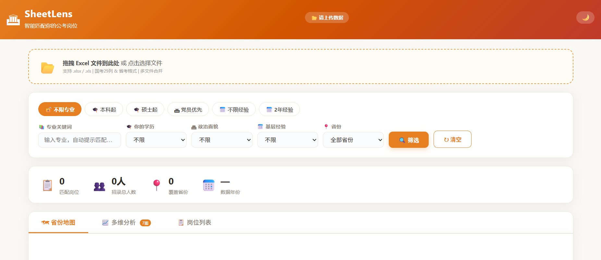
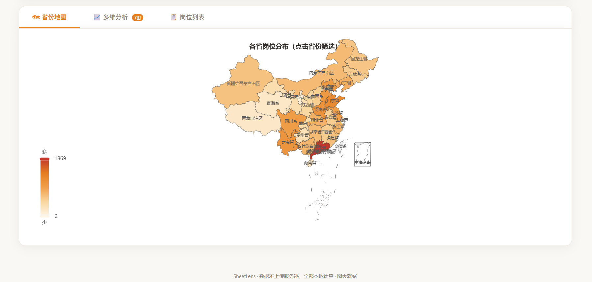
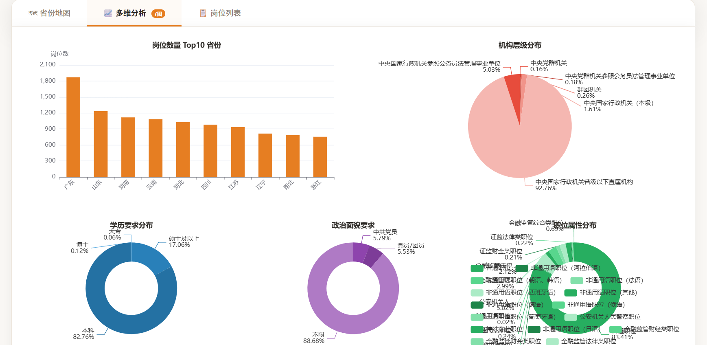
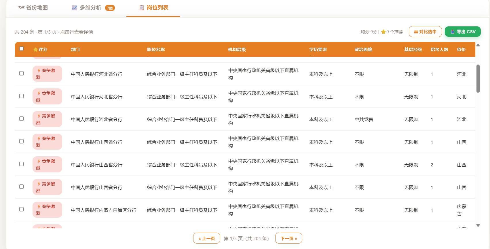

# SheetLens — 智能公考岗位筛选

单文件 HTML 工具，84KB，双击即用。拖拽上传国考/省考职位表，自动解析、筛选、评分、可视化、对比、导出。

## 截图

> 将下方截图保存至 `docs/` 目录：
> - `docs/upload-map.png` — 上传界面 + 地图热力图
> - `docs/filter-score.png` — 筛选条件 + 评分结果
> - `docs/table-compare.png` — 岗位列表 + 对比弹窗
> - `docs/dark-mode.png` — 暗色模式

## 功能全景

### 📂 数据导入
- 拖拽/点击上传 `.xlsx` / `.xls`
- 多文件合并 · 多 Sheet 自动遍历（跳过说明/汇总页）
- 智能表头检测（跳过合并单元格标题行）
- 自动从"工作地点"推断省份

### 🔍 筛选 & 评分
- 5 字段：专业关键词（模糊匹配+自动补全）· 学历 · 政治面貌 · 基层经验 · 省份
- 6 个快捷标签，一键填入常见条件
- **填写即筛选 + 填写即评分**，150ms 防抖实时响应
- **模糊搜索**：逐字跳跃匹配，「政法」→「政治学类、法学类」✅
- **自动补全**：输入时下拉提示数据中存在的专业，键盘 ↑↓ 导航
- **筛选标签条**：当前条件以彩色标签展示，点 × 单独取消
- **↩ 撤销**：最多 20 步历史，误操作一键回退

### ⭐ 智能评分
- 5 维 100 分：专业(30) + 学历(20) + 招录人数(20) + 政治面貌(15) + 基层经验(15)
- 四级标签：⭐强烈推荐(≥80) · 👍推荐(60-79) · 💡可考虑(40-59) · ⚡竞争激烈(<40)

### 📊 8 张图表（7 套独立配色）
1. 🗺 中国地图热力图（点击省份筛选）
2. 📊 岗位 Top10 省份柱状图
3. 🥧 机构层级分布
4. 🍩 学历要求分布
5. 🍩 政治面貌分布
6. 🍩 职位属性分布
7. 📊 招录部门 Top10
8. 🍩 基层经验要求

### 📋 表格
- 分页（50 条/页，无硬限制）
- 点击表头排序 · 点击行查看详情弹窗（含评分明细进度条）
- **⚖ 岗位对比**：勾选 2-3 个岗位，并排对比 10 个字段 + 评分
- CSV 导出

### 🎨 UI/UX
- 🌙 **暗色模式**：一键切换，图表自适应，偏好记忆
- 🎬 **新手引导**：首次打开 4 步遮罩引导
- 🔢 统计数字滚动动画 · 千分位格式化
- 💬 Toast 消息反馈 · 💾 localStorage 筛选记忆
- 🫁 上传区呼吸动画 · 表格行淡入 · 标签缩放入场

## 使用方式

1. 下载 `index.html`
2. 双击在浏览器中打开
3. 拖拽 Excel 文件到上传区（或先用 `examples/sample_data.xlsx` 体验）
4. 输入专业、学历等信息，自动筛选和评分

## 兼容性

- 国考标准格式（27 列，2026 年验证通过）
- 省考标准格式
- 带合并单元格说明行的变体（自动跳过）
- `.xlsx` / `.xls` 均支持

## 🌐 在线体验

无需下载，直接使用：**[🔗 在线 Demo](https://kaXianc2-gom.github.io/sheet-lens/)**

> ⚠️ 在线版同样纯本地运行，所有数据仅在浏览器内存中处理，不会上传到任何服务器。

## 🔐 隐私声明

- **数据不上传**：所有文件解析、筛选、评分均在浏览器本地内存中完成
- **无网络请求**：所有依赖（SheetJS / ECharts / DataV GeoJSON）均已内联，运行时零外部请求
- **无持久化存储**：数据仅在当前会话中，关闭浏览器后自动清除
- **localStorage 仅存偏好**：仅保存主题、筛选条件等用户设置，不保存源数据

> ⚠️ **免责声明**：本工具仅供数据筛选与参考辅助，不构成任何报考决策建议。所有信息以官方发布的职位表为准。

## 技术架构

- 纯 HTML + 原生 JS，零构建工具，零服务器
- SheetJS 内联（Excel 解析，离线可用）
- ECharts 内联（图表渲染，离线可用）
- 中国地图：DataV GeoJSON 内联
- 数据完全本地处理，不上传服务器

## AI 辅助声明

本项目开发过程中使用了 AI 辅助（Claude / Anthropic Claude Code）。

## 许可

MIT License
