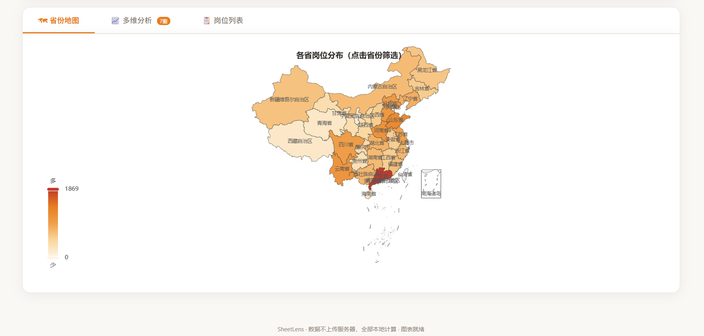
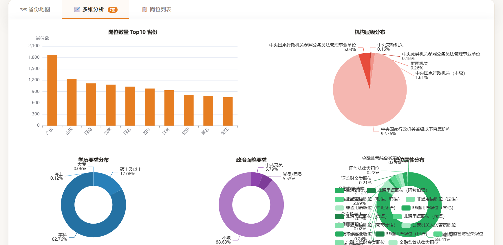
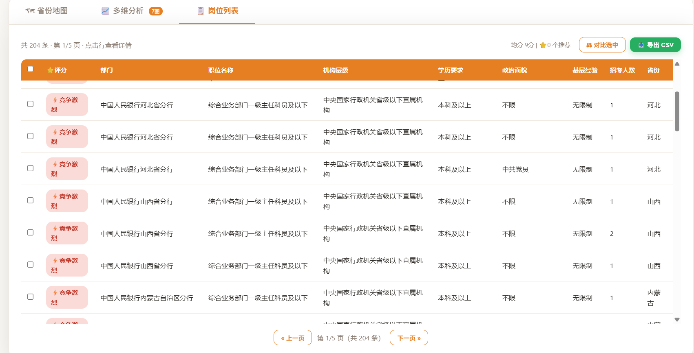

# SheetLens — 智能公考岗位筛选

[](LICENSE)
[](https://github.com/kaXianc2-gom/sheet-lens/releases)
[](https://kaXianc2-gom.github.io/sheet-lens/)

公考岗位筛选工具，多文件项目，双击 `index.html` 即可使用，**零网络请求、零构建、零安装**。拖拽上传国考/省考职位表，自动解析、筛选、评分、可视化、对比、导出。

## 项目结构

```
sheet-lens/
├── index.html              骨架（HTML + 22 个 SVG 图标库 + 引用）
├── styles.css              设计系统（28KB token 化 CSS）
├── app.js                  主业务 JS（63KB）
├── vendor/
│   ├── echarts.min.js      ECharts 5.5（1MB，CDN 备份）
│   ├── xlsx.full.min.js    SheetJS 0.18.5（640KB）
│   ├── china.geo.js        中国地图 GeoJSON（582KB，CDN 备份）
│   └── china.geo.json      同上原始 JSON（开发参考）
├── data/
│   ├── demo.json           13 条脱敏示例数据（开发参考）
│   └── demo.js             同上 .js wrapper（浏览器加载）
├── tests/                  Playwright E2E 测试（6 个）
├── playwright.config.js    Playwright 配置
├── package.json            dev 依赖：@playwright/test
├── build_data.py           离线数据预处理（生成 data/demo.json）
└── CHANGELOG.md / CONTRIBUTING.md / README.md / LICENSE
```

> **单文件版**：如需"双击即用、无项目结构"版本，可运行 `bash build-bundled.sh`（TODO）把 vendor/ 内联回 index.html，恢复 2.6MB 单文件。

## 体积（拆分后）

| 文件 | 体积 |
|---|---|
| index.html | **24KB**（原 2.37MB） |
| styles.css | 28KB |
| app.js | 63KB |
| vendor/echarts.min.js | 1MB |
| vendor/xlsx.full.min.js | 640KB |
| vendor/china.geo.js | 582KB |
| data/demo.js | 3KB |
| **最大单文件** | **1MB**（ECharts，< 之前 2.37MB 一半） |
| **总** | ~2.3MB |

## 截图

> 将下方截图保存至 `docs/` 目录：
> - `docs/upload-map.png` — 上传界面 + 地图热力图
> - `docs/filter-score.png` — 筛选条件 + 评分结果
> - `docs/table-compare.png` — 岗位列表 + 对比弹窗
> - `docs/dark-mode.png` — 暗色模式






## 功能全景

### 📂 数据导入
- 拖拽/点击上传 `.xlsx` / `.xls`
- 多文件合并 · 多 Sheet 自动遍历（跳过说明/汇总页）
- 智能表头检测（跳过合并单元格标题行）
- 自动从"工作地点"推断省份

### 🔍 筛选 & 评分
- 5 字段：专业关键词（模糊匹配+自动补全）· 学历 · 政治面貌 · 基层经验 · 省份
- 6 个快捷标签，一键填入常见条件
- **填写即筛选 + 填写即评分**，150ms 防抖实时响应
- **模糊搜索**：逐字跳跃匹配，「政法」→「政治学类、法学类」✅
- **自动补全**：输入时下拉提示数据中存在的专业，键盘 ↑↓ 导航
- **筛选标签条**：当前条件以彩色标签展示，点 × 单独取消
- **↩ 撤销**：最多 20 步历史，误操作一键回退

### ⭐ 智能评分
- 5 维 100 分：专业(30) + 学历(20) + 招录人数(20) + 政治面貌(15) + 基层经验(15)
- 四级标签：⭐强烈推荐(≥80) · 👍推荐(60-79) · 💡可考虑(40-59) · ⚡竞争激烈(<40)

### 📊 8 张图表（7 套独立配色）
1. 🗺 中国地图热力图（点击省份筛选）
2. 📊 岗位 Top10 省份柱状图
3. 🥧 机构层级分布
4. 🍩 学历要求分布
5. 🍩 政治面貌分布
6. 🍩 职位属性分布
7. 📊 招录部门 Top10
8. 🍩 基层经验要求

### 📋 表格
- 分页（50 条/页，无硬限制）
- 点击表头排序 · 点击行查看详情弹窗（含评分明细进度条）
- **⚖ 岗位对比**：勾选 2-3 个岗位，并排对比 10 个字段 + 评分
- CSV 导出

### 🎨 UI/UX
- 🌙 **暗色模式**：一键切换，图表自适应，偏好记忆
- 🎬 **新手引导**：首次打开 4 步遮罩引导
- 🔢 统计数字滚动动画 · 千分位格式化
- 💬 Toast 消息反馈 · 💾 localStorage 筛选记忆
- 🫁 上传区呼吸动画 · 表格行淡入 · 标签缩放入场

## 使用方式

1. 下载整个 `sheet-lens/` 目录
2. 双击 `index.html` 在浏览器打开（**所有依赖在本地**，不联网）
3. 拖拽 Excel 文件到上传区（或先用 `examples/sample_data.xlsx` 体验）
4. 输入专业、学历等信息，自动筛选和评分

### 本地开发

```bash
git clone https://github.com/kaXianc2-gom/sheet-lens.git
cd sheet-lens
# 双击 index.html 即可，无需 npm install
# 仅 E2E 测试需要：
npm install
npx playwright test
```

## 兼容性

- 国考标准格式（27 列，2026 年验证通过）
- 省考标准格式
- 带合并单元格说明行的变体（自动跳过）
- `.xlsx` / `.xls` 均支持

## 🌐 在线体验

无需下载，直接使用：**[🔗 在线 Demo](https://kaXianc2-gom.github.io/sheet-lens/)**

> ⚠️ 在线版同样纯本地运行，所有数据仅在浏览器内存中处理，不会上传到任何服务器。

## 🔐 隐私声明

- **数据不上传**：所有文件解析、筛选、评分均在浏览器本地内存中完成
- **无网络请求**：所有依赖（SheetJS / ECharts / DataV GeoJSON）均已内联，运行时零外部请求
- **无持久化存储**：数据仅在当前会话中，关闭浏览器后自动清除
- **localStorage 仅存偏好**：仅保存主题、筛选条件等用户设置，不保存源数据

> ⚠️ **免责声明**：本工具仅供数据筛选与参考辅助，不构成任何报考决策建议。所有信息以官方发布的职位表为准。

## 技术架构

- **多文件** 静态项目：HTML + CSS + JS 拆分（index.html + styles.css + app.js + vendor/ + data/）
- **零构建工具**（无 webpack / vite / npm run dev）
- **零服务器**（双击 index.html 即可）
- **零网络请求**（ECharts / SheetJS / GeoJSON / demo data 全部本地）
- 数据完全本地处理，不上传服务器

## 开发命令

```bash
# 跑 E2E 测试
npx playwright test

# 跑测试 + 截图
npx playwright test --update-snapshots

# 看 ECharts 控制台
# 打开 index.html 后按 F12，console 里看日志
```

## AI 辅助声明

本项目开发过程中使用了 AI 辅助（Claude / Anthropic Claude Code）。

## 许可

MIT License
